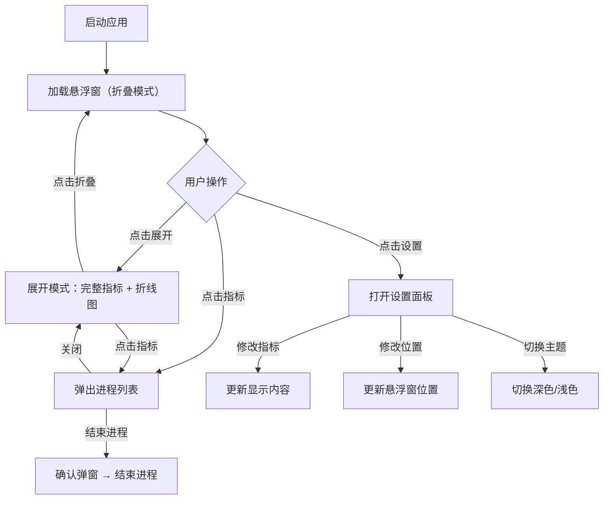

## 1. 产品概述

系统资源实时监控桌面悬浮工具，以小窗或半透明浮层形式常驻桌面一角，不干扰正常操作。面向需要实时掌握系统资源状态的开发者、运维人员和高级用户，提供直观、轻量、可定制的资源监控体验。

## 2. 核心功能

### 2.1 用户角色

| 角色 | 说明 |
|------|------|
| 桌面用户 | 本地使用，无需注册，直接交互 |

### 2.2 功能模块

1. **悬浮监控主窗口**：折叠/展开切换、拖拽移动、半透明浮层、屏幕角落钉选
2. **实时指标展示**：CPU各核心使用率、内存占用、网络上下行速度、GPU利用率和显存用量
3. **历史折线图表**：展开后查看最近N分钟滑动窗口的指标趋势
4. **进程列表弹窗**：点击某指标弹出占用该资源最高的进程列表，支持一键结束进程
5. **设置面板**：自定义显示指标、布局顺序、主题切换

### 2.3 页面详情

| 页面名称 | 模块名称 | 功能描述 |
|----------|----------|----------|
| 悬浮监控窗 | 折叠模式 | 仅显示最关键数字（CPU总占用、内存使用率、网络速度），极简小窗 |
| 悬浮监控窗 | 展开模式 | 完整指标卡片 + 折线历史图表，显示所有已开启指标 |
| 进程弹窗 | 进程列表 | 展示占用该资源最高的Top进程，显示PID、名称、占用值，支持结束进程 |
| 设置面板 | 指标配置 | 勾选显示/隐藏指标，拖拽排序布局顺序 |
| 设置面板 | 位置配置 | 选择钉选屏幕四角位置或自由拖拽 |
| 设置面板 | 主题配置 | 深色/浅色主题切换 |

## 3. 核心流程

## 4. 用户界面设计

### 4.1 设计风格

- **整体风格**：工业感监控仪表盘（Utilitarian-Dashboard），精密仪器感，强调数据可读性
- **主色调**：深色模式以深灰黑为底（#0d1117），搭配青绿色（#00d4aa）为主强调色，琥珀色（#f0a030）为次要强调色
- **浅色模式**：浅灰白底（#f6f8fa），搭配深青色（#00886a）和琥珀色（#c07820）
- **字体**：数据区域使用等宽字体 JetBrains Mono，标签使用 DM Sans
- **布局**：圆角卡片网格，折叠模式紧凑单行，展开模式双列网格
- **动效**：数据变化时数字微动画、折线图平滑过渡、展开/折叠弹性动画
- **透明度**：悬浮窗背景半透明（毛玻璃效果），折叠模式透明度更高

### 4.2 页面设计概览

| 页面名称 | 模块名称 | UI元素 |
|----------|----------|--------|
| 悬浮监控窗 | 折叠模式 | 半透明毛玻璃背景，单行紧凑布局，左侧状态点，右侧数字，微动画数字 |
| 悬浮监控窗 | 展开模式 | 双列卡片网格，每个卡片含指标名、当前值、迷你折线图，底部完整折线图区域 |
| 进程弹窗 | 进程列表 | 浮层弹窗，表格形式展示Top进程，行高亮，操作按钮红色 |
| 设置面板 | 配置区 | 侧边抽屉或模态框，复选框+拖拽排序列表，主题切换开关 |

### 4.3 响应式

- 桌面优先设计，悬浮窗宽度固定（折叠180px，展开400px）
- 高度根据内容自适应，最大高度限制

### 4.4 数据模拟

由于浏览器环境无法直接获取真实系统数据，使用模拟数据生成器：
- CPU各核心使用率：基于随机游走模拟，范围0-100%
- 内存占用：缓慢波动模拟，范围40-85%
- 网络上下行：突发流量模拟，下行0-50MB/s，上行0-10MB/s
- GPU利用率：模拟渲染负载波动，0-100%
- 显存用量：稳定波动，2-8GB范围
- 进程列表：模拟常见进程名及随机占用值
