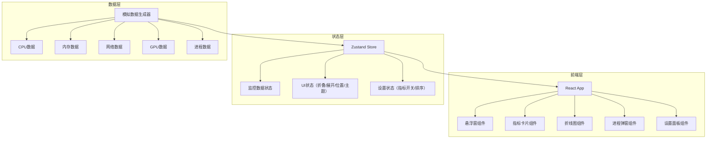

## 1. 架构设计



## 2. 技术说明

- **前端框架**：React 18 + TypeScript
- **样式方案**：Tailwind CSS 3
- **构建工具**：Vite
- **状态管理**：Zustand
- **图表库**：recharts（轻量折线图）
- **图标库**：lucide-react
- **初始化工具**：vite-init（react-ts模板）
- **后端**：无（纯前端，使用模拟数据）
- **数据库**：无

## 3. 路由定义

| 路由 | 用途 |
|------|------|
| / | 悬浮监控主界面（单页应用） |

本项目为单页面应用，无需路由，所有功能在一个悬浮窗内完成。

## 4. 组件架构

```
src/
├── App.tsx                    # 根组件
├── components/
│   ├── FloatingWidget.tsx     # 悬浮窗主容器（拖拽、折叠/展开、位置钉选）
│   ├── CollapsedView.tsx      # 折叠视图
│   ├── ExpandedView.tsx       # 展开视图
│   ├── MetricCard.tsx         # 指标卡片（CPU/内存/网络/GPU通用）
│   ├── CpuCoreGrid.tsx        # CPU核心网格展示
│   ├── HistoryChart.tsx       # 折线历史图表
│   ├── ProcessModal.tsx       # 进程列表弹窗
│   ├── SettingsPanel.tsx      # 设置面板
│   ├── ThemeToggle.tsx        # 主题切换按钮
│   └── DragSortList.tsx       # 拖拽排序列表
├── hooks/
│   ├── useSystemMetrics.ts    # 系统指标数据Hook（模拟数据）
│   └── useDrag.ts             # 拖拽移动Hook
├── store/
│   └── useMonitorStore.ts     # Zustand全局状态
├── utils/
│   ├── dataSimulator.ts       # 模拟数据生成器
│   └── constants.ts           # 常量定义
├── types/
│   └── index.ts               # TypeScript类型定义
└── main.tsx                   # 入口文件
```

## 5. 状态模型

```typescript
interface MonitorState {
  // 监控数据
  metrics: {
    cpu: { cores: number[]; overall: number }
    memory: { used: number; total: number; percentage: number }
    network: { upload: number; download: number }
    gpu: { utilization: number; vramUsed: number; vramTotal: number }
  }
  history: MetricHistory[]  // 最近N分钟历史记录
  processes: ProcessInfo[]

  // UI状态
  isExpanded: boolean
  position: 'top-left' | 'top-right' | 'bottom-left' | 'bottom-right' | 'free'
  customPosition: { x: number; y: number }
  theme: 'dark' | 'light'

  // 设置
  enabledMetrics: string[]
  metricOrder: string[]
  historyWindowMinutes: number

  // Actions
  toggleExpanded: () => void
  setPosition: (pos: Position) => void
  setTheme: (theme: Theme) => void
  toggleMetric: (metric: string) => void
  reorderMetrics: (from: number, to: number) => void
  killProcess: (pid: number) => void
  updateMetrics: () => void
}
```
